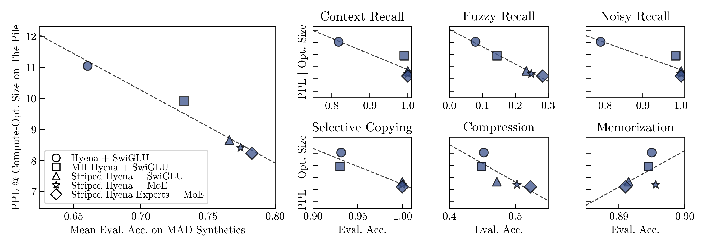
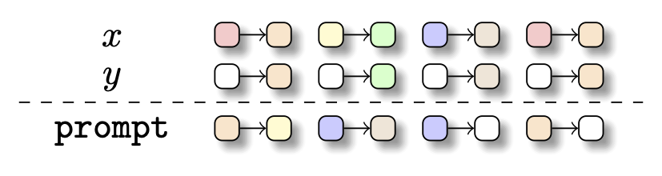
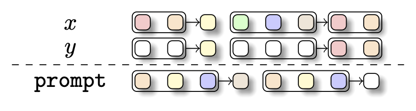
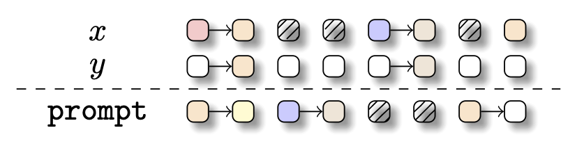
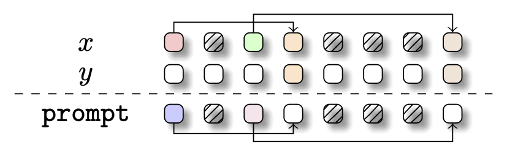
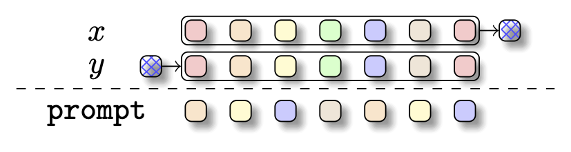
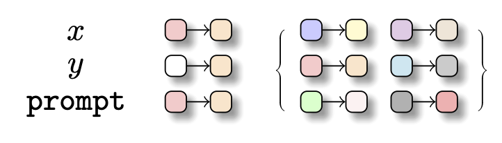

# $\text{MAD}$-Lab

<div align="center">

    
$\rightarrow$ A laboratory to improve and accelerate deep learning architecture protoyping using simple synthetic tasks.
</div>


**Mechanistic Architecture Design (in-short MAD)** represents a simple framework to accelerate the deep learning architecture design process. MAD uses simple synthetic tasks that can be implemented quickly and without much compute to predict how well new candidate architectures will perform at scale in sequence modeling. Each synthetic task is specifically designed to probe skills of a model relevant for squence modeling, such as compression and recall.

<u>*Why do we care about MAD?*</u> ...because we find that it accurately indicates compute-optimal perplexity of language models at scale:

<div align="center">

</div>

In addition to providing an implementation of the MAD synthetic task suite, this repository provides an implementation of several state-of-the-art layer primitives to allow for easy architecture prototyping, such as attention, Hyena, Mamba, and Gated Linear Attention.

For all details on the MAD synthetic tasks and pipeline, see our recent paper and the documentation below:
*preprint link will be inserted once it is online*


## Contents
- [Quickstart](#quickstart)
    - [Setup](#setup)
    - [Training](#training)
    - [Benchmarking](#benchmarking)
- [Repository overview](#repository-overview)
- [The MAD synthetic task suite](#the-mad-synthetic-tasks)
- [The MAD protocol](#the-mad-protocol)
- [Provided architecture primitives](#provided-architecture-primitives)
- [How to contribute](#how-to-contribute)
    - [Architectures](#architecture-primitives)
    - [Synthetic Tasks](#synthetic-tasks)
- [Example Uses](#example-uses)


## Quickstart
### Setup
We recommend that you run MAD in a dedicated Python environment (e.g., as provided by [Anconda](https://www.anaconda.com/download)). To install all required dependencies in an Anaconda environment, run:
```bash
conda create -n mad-lab python==3.11 -y && conda activate mad-lab
python -m pip install --trusted-host pypi.python.org -r requirements.txt
python -m pip install flash-attn causal-conv1d>=1.2.0 mamba-ssm
```
To train models on MAD, you will require access to cuda-capable hardware as many of the architecture components provided in this repository are specifically designed to run on cuda GPUs (such as [FlashAttention](https://github.com/Dao-AILab/flash-attention)).


### Training
The [train.py](train.py) script provides an entrypoint for training models on individual MAD synthetic tasks.

#### Using the command-line:
To train models built from architecture primitives provided in this repository, you can run the [train.py](train.py) script with the command line:
```bash
python -m train --task in-context-recall --layers mh-attention swiglu mh-attention swiglu
```
This will train a 4-layer model, composed of multi-head attention, SwiGLU, multi-head attention, SwiGLU in the [in-context recall task](#the-mad-synthetic-tasks). By default, each layer is configured according to our default layer configurations in [configs/layers/](configs/layers/)). For an overview of all provided command-line arguments, see the `get_args()` function in [train.py](train.py).

#### Using the code:
If you want to train architectures using components not provide in this repository, you can do so with the `train(...)` function provided in the [train.py](train.py) script:
```python
from train import train
from mad.configs import MADConfig

# create your PyTorch model:
model = ... 

# configure MAD:
mad_config = MADConfig(task='in-context-recall')
# for an overview of the MAD settings,
# see MADConfig in mad/configs.py

# train your model:
results = train(
    model=model,
    mad_config=mad_config, 
    log_path='./logs/{insert-your-model-name}',
)
```
This will train your model in the [in-context recall task](#the-mad-synthetic-tasks) and return a dataframe with an overview of the final training and evaluation performance of your model. 


### Benchmarking
Beyond training models in individual tasks, this repository provides a means to easily benchmark architectures across the entire [MAD protocol](#the-mad-protocol) with the [benchmark.py](benchmark.py) script.

#### Downloading the data:
To benchmark an architecture, you will first need to download our benchmark data, which is hosted at: [https://zenodo.org/records/10843663](https://zenodo.org/records/10843663).
Please download the data and place it in this directory under the following path: `./benchmark/data` (as shown in our [repository overview](#repository-overview)).

#### Using the command-line:
To benchmark an architecture composed of the architecture primitives provided in this repository, you can run:
```bash
python -m benchmark --layers hyena swiglu hyena swiglu
```
This will run a simple 4-layer model, composed of Hyena, SwiGLU, Hyena, and SwiGLU (configured according to our default layer configurations in [configs/layers/](configs/layers/)), through the MAD protocol. For an overview of all provided command-line arguments, see the `get_args()` function in [benchmark.py](benchmark.py).

#### Using the code:
If you want to benchmark new architectures, using components not provided in this repository, you can do so with the `benchmark(...)` function of the [benchmark.py](benchmark.py) script.

As several task variables are varied throughout the MAD benchmark, such as input sequence length and vocabulary size, you will first need to set up a function that creates the model you want to benchmark based on these task settings. This is an example of such a function:
```python
from torch import nn
from mad.model.model import LanguageModel, AutoEncoder
from mad.model.layers import hyena, swiglu

def make_model_fn(
    task: str,
    vocab_size: int,
    max_length: int,
) -> nn.Module:

    # a list of the layer modules composing your architecture:
    layers = [hyena, swiglu, hyena, swiglu]
    # these need to be torch.nn.Module instances!
    
    # setup a config for each of your layer types:
    hyena_config = {'dim': 128, 'max_length': max_length}
    swiglu_config = {'dim': 128, 'max_length': max_length}
    # (128 is the default model width of the MAD protocol)
    # and concatenate them into a list, with one entry for each layer:
    layer_configs = [hyena_config, swiglu_config, hyena_config, swiglu_config]
    
    # select the correct model backbone for your layers:
    backbone = LanguageModel if task not in {'compression'} else AutoEncoder
    # we recommend that you use these 2 backbones to make your results
    # comparable to the results provided in our paper
    
    return backbone(
        vocab_size=vocab_size,
        max_length=max_length,
        layers=layers,
        layer_cfgs=layer_configs
    )
```
As you can see, the function should accept three keyword arguments:
- `task` (str): the name for the MAD synthetic task. Here, we only use this variable to select an appropriate model backbone for your layers ... but who knows maybe there are other things in your architecture depending on it as well?
- `vocab_size` (int): the size of the vocabulary used in the current task setting.
- `max_length` (int): the maximum sequence length encountered in the current task setting.

Once you have created a function that creates your model given these arguments, you can go ahead and run it through the MAD protocol:
```python
mad_scores = benchmark(make_model_fn=make_model_fn, model_id='{insert-your-model-name}')
```
This will return a pandas series (`mad_scores`) with a MAD score for your model in each synthetic task of the MAD protocol.


## Repository Overview
```
/benchmark
┗ 📂 data
┃    ┗ 📂 t-* -> one directory for each benchmark task setting
┃    ┃    ┗ 📂 test
┃    ┃    ┃    ┗ inputs.npy 
┃    ┃    ┃    ┗ targets.npy 
┃    ┃    ┗ 📂 train
┃    ┃         ┗ inputs.npy 
┃    ┃         ┗ targets.npy 
┃    ┗ 📂 t-*
┃    ┗ ...

/configs -> default layer and task settings
┣ 📂 layers
┃    ┗ *.yml
┣ 📂 tasks
┃    ┗ *.yml

/mad
┣ 📂 data
┃   ┗ __init__.py
┃   ┗ dataset.py -> creating datasets given a function generates instances of a task
┃   ┗ instances.py -> generating instances of each task
┣ 📂 model
┃    ┣ 📂 layers
┃    ┃    ┗ 📂 featurization -> everything used to featurize layers
┃    ┃    ┗ 📂 ops
┃    ┃    ┗ 📂 rwkv
┃    ┃    ┗ __init__.py
┃    ┃    ┗ attention_gated_linear.py 
┃    ┃    ┗ attention_linear.py
┃    ┃    ┗ attention.py
┃    ┃    ┗ hyena.py
┃    ┃    ┗ mamba.py
┃    ┃    ┗ mlp.py
┃    ┃
┃    ┣ __init__.py
┃    ┣ auto_encoder.py
┃    ┣ language_model.py
┃    ┗ pl_model_wrapper.py
┃
┣ __init__.py
┣ analysis.py -> tools to analyze benchmark results
┣ configs.py -> dataclasses we use to configure MAD
┣ metrics.py -> metrics for training / evaluation
┣ paths.py -> some tools to make and parse paths
┗ registry.py -> registry for all layers and tasks of this repository

benchmark.py -> benchmarking models on MAD
train.py -> training a model on individual tasks
.gitignore.py
README.md
requirements.txt
```


## The MAD synthetic tasks
MAD spans six simple token manipulation tasks. We provide a brief overview of each task in the following. For more details, please see our paper.

### `in-context-recall`

To answer a prompt well, language models must be able to understand and learn from new information presented in the prompt (so-called in-context learning). A wealth of empirical work has demonstrated that the associative recall task is well-suited to test the in-context learning skill. MAD uses a multi-query variant of this task: Given an input sequence of key-value pairs, models are tasked with retrieving all values from the input sequence associated with keys that were already shown in the input sequence. Note that while the mapping from keys to values is consistent within an input sequence, it is randomly shuffled between sequences.

### `fuzzy-in-context-recall`

In language, semantic units are often spread out over multiple adjacent tokens (e.g., "blue sky" vs "gray sky"). To test how capable a model is of semantically grouping together adjacent tokens, MAD utilizes a variant of in-context recall, in which keys and values are composed of a variable number of adjacent tokens. Specifically, for each sequence, variable length keys and values are randomly drawn from the vocabulary and then assigned into pairs. Since the structure of key/value lengths in a sequence, as well as the mapping from keys to values, change between sequences, fuzzy recall can be treated as a more challenging variant of in-context recall.

### `noisy-in-context-recall`

To answer a prompt well, language models must be able to ignore irrelevant information of the input. To test this skill, MAD uses another adaptation of in-context recall, in which irrelevant information, represented by tokens from a distinct vocabulary, is added in an arbitrary and variable pattern in between the key-value pairs.
Note that this adds a memorization aspect to the task, as models need to learn during training to ignore tokens from the noise vocabulary.

### `selective-copying`

In addition to ignoring irrelevant information of an input, language models must be able to selectively remember relevant information of an input. To test this skill, MAD uses a selective copying task, in which models are tasked with copying tokens from one position of an input sequence to a later position of the sequence, while ignoring irrelevant noise tokens that are randomly inserted into the sequence. Importantly, tokens are always copied in their order of occurrence. Models thereby need to not just remember the tokens that are to be copied but also their specific order of occurrence in the sequence.

### `compression`

Recent findings in the mechanistic interpretability literature indicate that a key skill of language models is "token concatenation", where early attention layers assemble information that is spread across multiple tokens in an input onto another token so that the assembled information can then be decoded well by subsequent MLPs. To test the ability of a model to perform token concatenation, even without attention and MLP, MAD utilizes a compression task. In this task, models are trained to compress a random sequence of input tokens into a single aggregation token so that the original input sequence can be fully recovered from the aggregation token by a subsequent MLP.

### `memorization`

In addition to manipulating and retrieving information from an input sequence, language modeling requires the memorization of factual knowledge. To test this skill, MAD utilizes a memorization task, in which models are tasked with learning a fixed key-value mapping (resembling facts in language) from the training data. Unlike recall, the mapping requires no in-context computation as the ground-truth mapping is constant across samples. 


## The MAD Protocol
MAD follows a two-step procedure, starting from the design of a new candidate architecture, followed by its systematic evaluation according to the following key principles: 

1. For each synthetic task, a MAD score is obtained by averaging architecture performances across a range of task difficulty levels. To manipulate difficulty, MAD independently varies a set of relevant experimental variables: length of the input sequence, size of the vocabulary, and size of the training set. Some tasks have additional variables such as the ratio of noise tokens in the noisy recall and selective copying tasks. For an overview of the changes applied to each task, see the changes entry in each task config in [configs/tasks/](configs/tasks/).

2. Fixed-state architectures need to be normalized to an iso-state and iso-parameter setting, including models featuring sparsely activated layers such as Mixture-of-Experts. For details on this, please see our paper!

3. To ensure that model performance estimates are not dependent on a specific optimization setting, MAD sweeps each architecture in each task setting over a 3 x 2 grid of learning rate and weight decay values (learning rates: $0.0001, 0.0005, 0.001$, weight decays: $0., 0.1$). MAD scores are based on the best runs from this sweep.

4. Model performances are always evaluated in an independent evaluation dataset, specific to each task setting.


## Provided architecture primitives
For an overview of all provided layer types, see the [mad/model/layers/](mad/model/layers/) directory as well as our layer registry in [mad/registry.py](mad/registry.py). For an overview of the default layer configurations, see their respective configurations in [configs/layers/](configs/layers/).

### Channel-mixing:
- `mlp`: Standard expanding multi-layer perceptron, [implementation](mad/model/layers/mlp.py)
- `swiglu`: Swish-Gated-Linear Unit, [implementation](mad/model/layers/mlp.py)
- `moe-mlp`: A Mixture-of-Experts MLP variant, [implementation](mad/model/layers/mlp.py)

### Sequence-mixing:
- `attention`: [paper](https://arxiv.org/abs/2307.08691), [implementation](mad/model/layers/attention.py)
    - `sliding-attention`: implements a sliding-window variant of attention
- `hyena`: [paper](https://arxiv.org/abs/2302.10866), [implementation](mad/model/layers/hyena.py)
    - `hyena-experts`: as proposed in the MAD paper, [implementation](mad/model/layers/hyena.py)
- `mamba`: [paper](https://arxiv.org/abs/2312.00752), [implementation](mad/model/layers/mamba.py)
- `linear-attention`: [paper](https://arxiv.org/abs/2006.16236), [implementation](mad/model/layers/attention_linear.py)
- `gated-linear-attention`: [paper](https://arxiv.org/abs/2312.06635), [implementation](mad/model/layers/attention_gated_linear.py)
- `rwkv{5,6}`: [paper](https://arxiv.org/abs/2305.13048), [implementation](mad/model/layers/rwkv)

Note that we also provide respective multi-head variants for layers supporting this type of state expansion, which you can call by simply adding `mh-` (for multi-head) to the layer's name, eg: `mh-hyena`. 


## How to contribute
We are hoping that MAD will grow as an open source tool for easy and compute-efficient architecture prototyping. We therefore welcome contributions of new architecture primitives and synthetic tasks.

### Architecture primitives:
To contribute a new architecture primitive, please proceed as follows:
0. Fork this repository.
1. Add an implementation of your layer primitive to [mad/model/layers](mad/model/layers/); Ideally, your implementation is self-contained in one script. For featurizations and ops used by your layer, we also provide the [ops](mad/model/layers/ops/) and [featurizations](mad/model/layers/featurizations/) directories.
2. Add a default configuration for your layer to [configs/layers](configs/layers/). Please make sure that your layer configuration is normalized to the iso-state and iso-parameter setting we use for MAD (see our paper for details on this).
3. Add an import for your layer to [mad/model/layers/__init__.py](mad/model/layers/__init__.py) and create an entry for your layer in our layer registry in [mad/registry.py](mad/registry.py).
4. Verify that your layer is fully compatible with our [train.py](train.py) and [benchmark.py](benchmark.py) scripts.
5. Once you have completed these steps, create a [pull request](https://docs.github.com/en/pull-requests/collaborating-with-pull-requests/proposing-changes-to-your-work-with-pull-requests/about-pull-requests), which we will then review.

### Synthetic tasks:
To contribute a new synthetic task, please proceed as follows:
0. Fork this repository.
1. Write a function that creates a single instance of the synthetic task you would like to add and add it to [mad/data/instances.py](mad/data/instances.py). This function needs to return two numpy arrays: inputs and targets. Take a look at our current implementations, as well as the MADConfig in [mad/configs.py](mad/configs.py), to get an overview of all relevant keyword arguments.
2. Add a configuration for your task to [configs/tasks](configs/tasks/), making sure that it contains all relevant arguments for the baseline setting, as well as all relevant entries to manipulate task difficulty (indicated by "changes"). Use the existing task configurations as a guideline.
3. Make sure to add an entry for your to the layer registry in [mad/registry.py](mad/registry.py).
4. Verify that the models implemented in this repository can be trained on your task.
5. Once you have completed these steps, create a [pull request](https://docs.github.com/en/pull-requests/collaborating-with-pull-requests/proposing-changes-to-your-work-with-pull-requests/about-pull-requests), which we will then review.


## Example Uses
We collect scripts showing basic usecases for MAD in [scripts/](scripts/).

### Architecture Improvement:
[scripts/architecture_improvement.py](scripts/architecture_improvement.py) shows an example demonstrating how to compare the performance of multiple variants of a base architecture.


## Thank you! :pray:
All of this work would not be possible without the many amazing open source implementations that we are building on, such as [FlashAttention](https://github.com/Dao-AILab/flash-attention), [flash attention linear](https://github.com/sustcsonglin/flash-linear-attention), [rwkv](https://github.com/BlinkDL/RWKV-LM/tree/main), [mamba](https://github.com/state-spaces/mamba), and [hyena](https://github.com/HazyResearch/safari).
